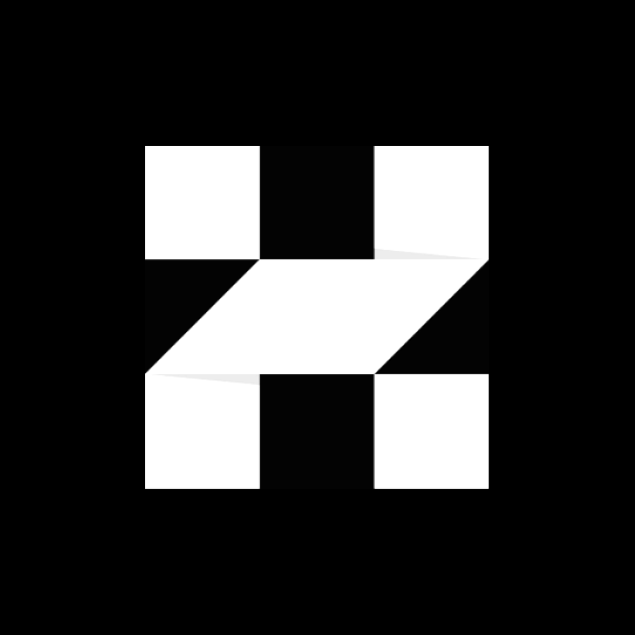

# Zoo Industries

<p align="center">
  
</p>

Marketing site for [Zoo Industries Inc](https://zoo.industries) and the
[Zoo Labs Foundation](https://zoo.ngo) — an open AI research network
advancing decentralized AI (DeAI) and decentralized science (DeSci).

**Live:** [zoo.industries](https://zoo.industries)

---

## Quick Start

```sh
pnpm install
pnpm dev          # http://localhost:8080
pnpm build        # static export to out/
```

Requires Node.js 22+ and pnpm.

## Architecture

Next.js App Router with static export (`output: 'export'`). All marketing pages
live under a `(marketing)` route group sharing a common layout with navbar,
footer, and global chat widget.

All brand data is centralized in `site.config.ts` — fork that file and the
public assets to rebrand the entire site.

```
app/
  layout.tsx                  # Root layout (Geist font, ThemeProvider)
  globals.css                 # Tailwind 4 base styles
  (marketing)/
    layout.tsx                # Navbar + Footer + ChatWidget
    page.tsx                  # Homepage
    about/                    # Foundation overview, capabilities
    models/                   # Zen model catalog
    auth/                     # OAuth flow (zoo.id)
    blog/                     # Blog index
    capabilities/             # Capability deep-dives
    careers/                  # Listings + global offices
    case-studies/             # Research and deployment cases
    contact/                  # Form + Cal.com scheduling
    news/                     # Announcements
    press/                    # Press coverage
    pricing/                  # Pricing tiers
    products/[slug]/          # Dynamic product pages
    research/                 # 130+ papers, category filters
    security/, services/, solutions/, status/, team/, terms/, privacy/

components/
  ui/                         # shadcn/ui primitives (Radix)
  Navbar.tsx, Footer.tsx, Hero.tsx, Logo.tsx
  GlobalChatWidget.tsx        # AI chat (SSE streaming, Zen models)
  Leadership.tsx, CaseStudies.tsx, ResearchHighlights.tsx
  Contact.tsx, CommandPalette.tsx, ThemeProvider.tsx

lib/
  data/                       # Products, models, etc.
  utils.ts                    # Shared utilities

site.config.ts                # SINGLE SOURCE OF TRUTH for brand data
public/
  CNAME                       # zoo.industries
  llms.txt                    # LLM-readable site summary
```

## Tech Stack

| Layer | Technology |
|-------|-----------|
| Framework | Next.js 15 (App Router, static export) |
| UI | React 19, TypeScript 5 |
| Styling | Tailwind CSS 4, tailwindcss-animate |
| Components | shadcn/ui (Radix primitives), Lucide icons |
| Animation | Framer Motion 12 |
| Forms | React Hook Form, Zod validation |
| State | TanStack React Query |
| Theme | next-themes (light/dark/system) |
| Fonts | Geist Sans, Geist Mono |

## Deployment

Static export to GitHub Pages.

1. Push to `main` triggers the deploy workflow
2. Build runs `pnpm build` producing the `out/` directory
3. `out/index.html` is copied to `out/404.html` for SPA client-side routing
4. Deployed to GitHub Pages with custom domain `zoo.industries`

The `CNAME` file in `public/` points to `zoo.industries`.

## Related Properties

| Property | URL | Purpose |
|----------|-----|---------|
| Zoo Foundation | [zoo.ngo](https://zoo.ngo) | 501(c)(3) research network |
| Zoo Network | [zoo.network](https://zoo.network) | Chain + DEX + DeAI infra |
| Zoo Exchange | [zoo.exchange](https://zoo.exchange) | Decentralized exchange |
| ZIPs | [zips.zoo.ngo](https://zips.zoo.ngo) | Improvement proposals |
| Zen Models | [huggingface.co/zenlm](https://huggingface.co/zenlm) | Model weights |
| Hanzo AI | [hanzo.ai](https://hanzo.ai) | AI infrastructure partner |
| Lux Network | [lux.network](https://lux.network) | Settlement layer |

## License

MIT — see [LICENSE](LICENSE).
